<!-- ═══════════════════════════ GÉNÉRIQUE D'OUVERTURE ═══════════════════════════ -->

---

## 🍿 EN SALLE — Portfolio

<b>🎬 Le long métrage complet : projets, réalisations et démos interactives</b> 
<a href="https://imadmallahi.github.io/portfolio-higgs/">https://imadmallahi.github.io/portfolio-higgs/</a>

---

## 🎞️ SYNOPSIS

> *Un ingénieur, six décors, une seule obsession : livrer du code propre qui tient en production.*

Ingénieur **Full Stack** spécialisé sur l'écosystème **Java / Spring Boot** côté serveur et **Angular / TypeScript** côté interface.
Mon terrain de jeu : les applications métier exigeantes — **banque, télécom, e-commerce** — là où la sécurité, la performance et la maintenabilité ne sont pas négociables.

| | |
|---|---|
| 🚀 **Rôle principal** | Conception & développement d'applications d'entreprise de bout en bout |
| 💻 **Back-end** | Java, Spring Boot, Microservices, Architecture hexagonale |
| 🎨 **Front-end** | Angular, TypeScript, Angular Material |
| 🔐 **Sécurité** | Keycloak, JWT, Spring Security |
| ⚡ **Qualité** | JUnit 5, Mockito, SonarQube, JMeter |
| 🧠 **Méthodes** | Scrum, Kanban, UML, Merise, POO |

---

## 🎭 CASTING TECHNIQUE

| Rôle | Distribution |
|:---|:---|
| **Langages** | Java · Python · JavaScript · TypeScript · C++ |
| **Technologies Web** | Spring · EJB · JSF · Swagger · Angular · React |
| **DevOps & Cloud** | GitLab CI · Jenkins · Docker · Wildfly · WebSphere · JFROG |
| **Tests & Qualité** | JUnit 5 · Mockito · JMeter · SonarQube |
| **Bases de données** | SQL Server · MySQL · Oracle · MongoDB |
| **Environnements** | Eclipse · IntelliJ · VS Code · Postman |
| **Conception** | UML · Merise · POO · Scrum · Kanban |

 

<b>🧬 PLAN 01 — Carte des compétences</b>

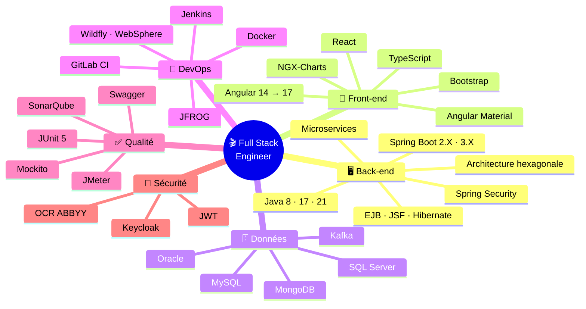

<b>🎯 PLAN 02 — Grille de lecture technique</b>

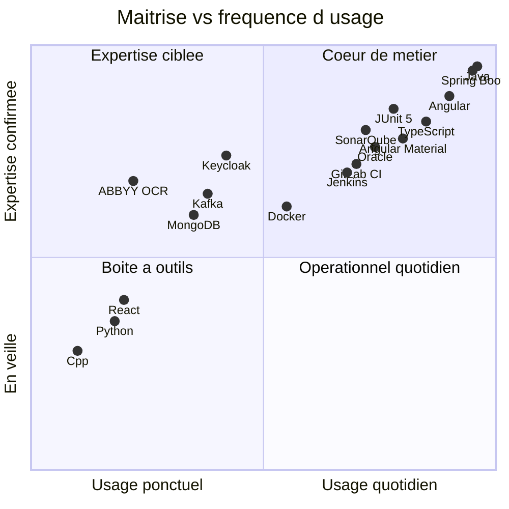

<b>📊 PLAN 03 — Niveaux de maîtrise</b>

| Technologie | Niveau | Depuis |
|:---|:---|:---:|
| **Java** `8 · 17 · 21` | `██████████` | 2020 |
| **Spring Boot** `2.X · 3.X` | `██████████` | 2021 |
| **Angular** `14 → 17` | `█████████░` | 2021 |
| **TypeScript** | `████████░░` | 2021 |
| **JUnit 5 · Mockito** | `█████████░` | 2020 |
| **SQL Server · Oracle** | `████████░░` | 2020 |
| **SonarQube** | `████████░░` | 2021 |
| **GitLab CI · Jenkins** | `███████░░░` | 2021 |
| **Keycloak · JWT** | `███████░░░` | 2021 |
| **Kafka · MongoDB** | `██████░░░░` | 2024 |
| **Docker** | `██████░░░░` | 2022 |
| **React · Python** | `████░░░░░░` | — |

---

## 🎬 FILMOGRAPHIE

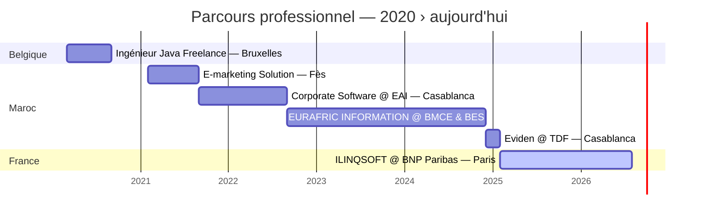

<b>🧭 PLAN 04 — Évolution de la stack, année par année</b>

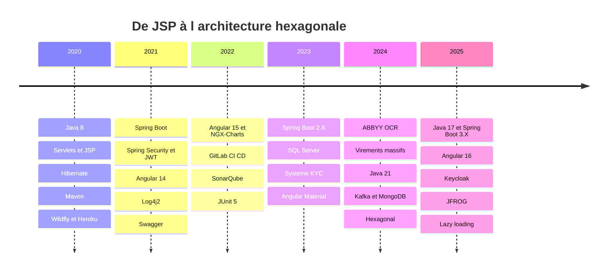

<b>🌍 PLAN 05 — Les décors du tournage</b>

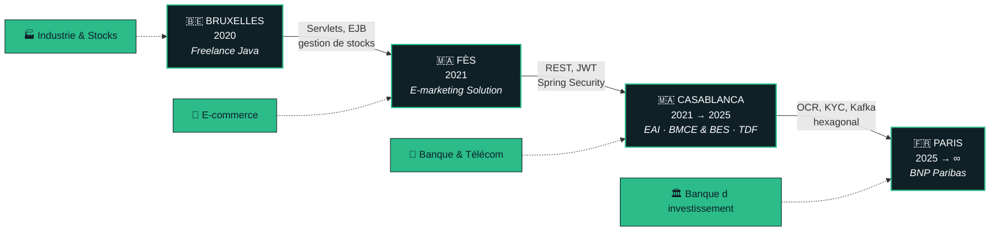

 

### 🎥 ACTE VI — « La Place Financière » 

**Consultant Full Stack** — ILINQSOFT SASU chez **BNP Paribas**
📍 Paris, France · 🗓 Février 2025 → Présent

`Java 17` `Spring Boot 3.X` `Angular 16` `Jenkins` `GitLab` `JFROG` `Oracle` `SonarQube`

- Conception et implémentation de modules applicatifs
- Gestion de l'interface utilisateur avec **Angular Material**
- Implémentation des couches de sécurité et tests unitaires (**JUnit 5**)
- Optimisation des performances via modules chargés de manière différée
- Configuration de rapports de couverture avec **SonarQube**

---

### 🎥 ACTE V — « Signal & Diffusion »

**Ingénieur Fullstack Confirmé** — Eviden chez **TDF**
📍 Casablanca, Maroc · 🗓 Décembre 2024 → Février 2025

`Java 21` `Spring Boot 3.X` `Angular 17` `Kafka` `MongoDB` `Oracle` `Jenkins` `GitLab` `SonarQube`

- Conception de l'**architecture hexagonale**
- Création de l'API principale et gestion des gabarits
- Gestion des incidents de production et interface **Angular Material**
- Implémentation de la sécurité avec **Keycloak**

---

### 🎥 ACTE IV — « OCR & Conformité »

**Ingénieur Fullstack** — EURAFRIC INFORMATION chez **BMCE & BES**
📍 Casablanca, Maroc · 🗓 Septembre 2022 → Décembre 2024

`Java 8` `Spring Boot 2.X` `Angular 14` `TypeScript` `SQL Server` `ABBYY OCR` `Jenkins` `GitLab` `Oracle` `SonarQube`

- **Automatisation des virements massifs** avec OCR *(2024)*
- Mise en place d'un système **KYC** *(2023)*
- Conception de l'architecture et de l'API principale
- Interface **Angular Material** et sécurité **JWT / Spring Security**

---

### 🎥 ACTE III — « Data & Dataviz »

**Java Consultant** — Corporate Software chez **EAI**
📍 Casablanca, Maroc · 🗓 Septembre 2021 → Septembre 2022

`Java 8` `Angular 14/15` `NGX-Charts` `Git` `GitLab CI/CD` `SonarQube` `Angular Material` `Bootstrap` `Swagger`

- Développement d'applications Java/Angular pour la **BMCE** et **DabaTransfert**
- Création de **graphiques interactifs** et migration vers Angular 15
- Tests unitaires (**JUnit 5**) et optimisation des performances

---

### 🎥 ACTE II — « Premiers REST »

**Ingénieur Fullstack** — E-marketing Solution
📍 Fès, Maroc · 🗓 Février 2021 → Septembre 2021

`Java` `Spring Boot` `Spring Security` `Angular` `GitLab CI/CD` `SonarQube` `JUnit` `Postman` `Swagger`

- Services **RESTful** pour guides d'achat
- Sécurisation avec **JWT** et Spring Security
- Mise en place de journalisation **Log4j2** et support technique

---

### 🎥 ACTE I — « Le Premier Rôle »

**Ingénieur Java Freelance**
📍 Bruxelles, Belgique · 🗓 Mars 2020 → Septembre 2020

`Java` `Maven` `Hibernate` `JSP` `Git` `Wildfly` `Heroku`

- Conception d'une application web de **gestion de stocks**
- Développement des **servlets** et **EJB**
- Optimisation des requêtes SQL et maintenance corrective

---

## 🎥 PLATEAU TECHNIQUE

> *Les coulisses : comment se construit une application, plan par plan.*

<b>🏗️ PLAN 06 — Architecture de référence (hexagonale)</b>

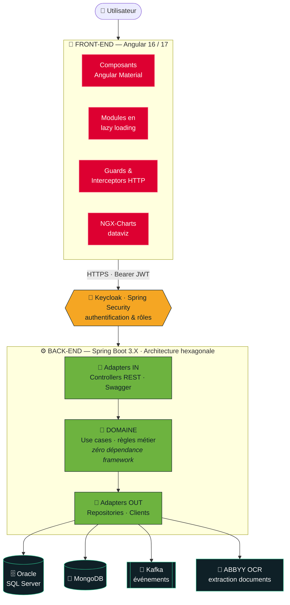

<b>🔐 PLAN 07 — Séquence d'authentification & appel sécurisé</b>

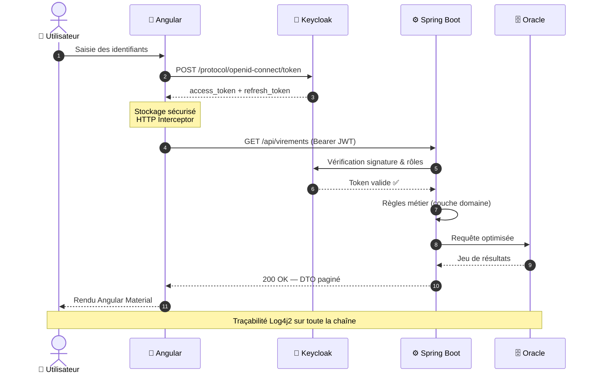

<b>🚀 PLAN 08 — Chaîne d'intégration continue</b>

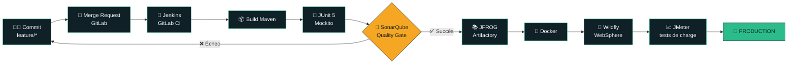

<b>🎞️ PLAN 09 — Salle de montage (workflow Git)</b>

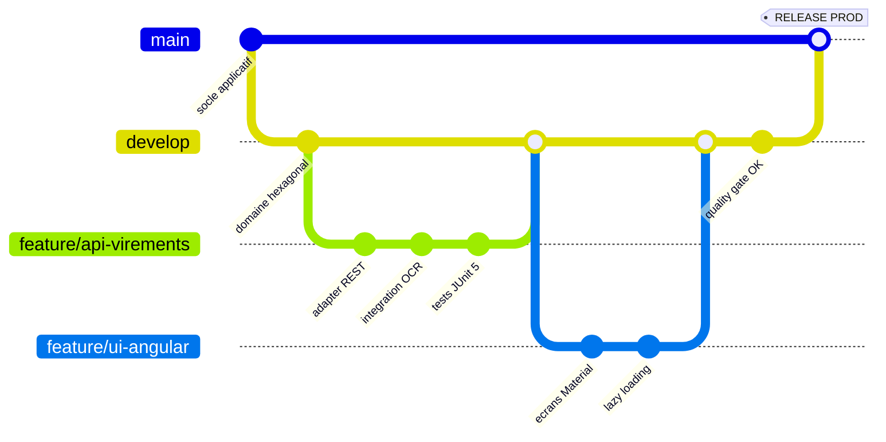

<b>🗺️ PLAN 10 — Le parcours d'une feature, du cadrage à la prod</b>

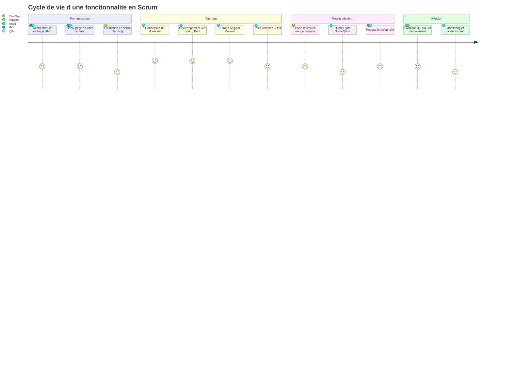

---

## 🎟️ STATISTIQUES DE PRODUCTION

<b>🥧 PLAN 11 — Répartition de mon activité</b>

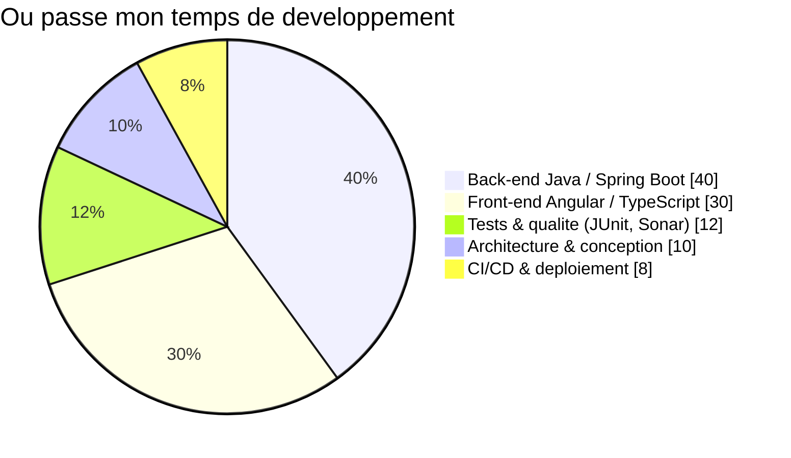

<b>🏢 PLAN 12 — Secteurs d'intervention</b>

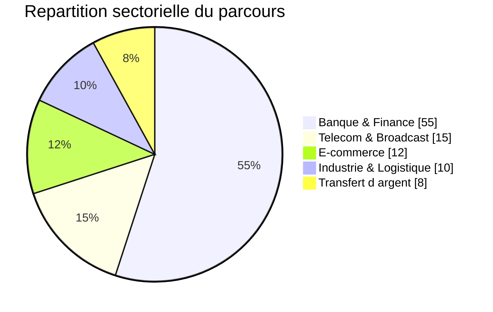

---

## 🏆 PALMARÈS

<picture>
<source media="(prefers-color-scheme: dark)" srcset="https://github-profile-summary-cards.vercel.app/api/cards/profile-details?username=imadmallahi&theme=tokyonight"/>
<source media="(prefers-color-scheme: light)" srcset="https://github-profile-summary-cards.vercel.app/api/cards/profile-details?username=imadmallahi&theme=github"/>

</picture>

---

## 📊 BOX OFFICE

<picture>
<source media="(prefers-color-scheme: dark)" srcset="https://github-profile-summary-cards.vercel.app/api/cards/stats?username=imadmallahi&theme=tokyonight"/>
<source media="(prefers-color-scheme: light)" srcset="https://github-profile-summary-cards.vercel.app/api/cards/stats?username=imadmallahi&theme=github"/>

</picture>
<picture>
<source media="(prefers-color-scheme: dark)" srcset="https://github-profile-summary-cards.vercel.app/api/cards/most-commit-language?username=imadmallahi&theme=tokyonight"/>
<source media="(prefers-color-scheme: light)" srcset="https://github-profile-summary-cards.vercel.app/api/cards/most-commit-language?username=imadmallahi&theme=github"/>

</picture>

<picture>
<source media="(prefers-color-scheme: dark)" srcset="https://github-profile-summary-cards.vercel.app/api/cards/repos-per-language?username=imadmallahi&theme=tokyonight"/>
<source media="(prefers-color-scheme: light)" srcset="https://github-profile-summary-cards.vercel.app/api/cards/repos-per-language?username=imadmallahi&theme=github"/>

</picture>
<picture>
<source media="(prefers-color-scheme: dark)" srcset="https://github-profile-summary-cards.vercel.app/api/cards/productive-time?username=imadmallahi&theme=tokyonight&utcOffset=1"/>
<source media="(prefers-color-scheme: light)" srcset="https://github-profile-summary-cards.vercel.app/api/cards/productive-time?username=imadmallahi&theme=github&utcOffset=1"/>

</picture>

<picture>
<source media="(prefers-color-scheme: dark)" srcset="https://streak-stats.demolab.com?user=imadmallahi&theme=tokyonight&hide_border=true&background=0f2027&ring=2BBC8A&fire=2BBC8A&currStreakLabel=2BBC8A"/>
<source media="(prefers-color-scheme: light)" srcset="https://streak-stats.demolab.com?user=imadmallahi&theme=default&hide_border=true&ring=2BBC8A&fire=2BBC8A&currStreakLabel=0f2027"/>

</picture>

<picture>
<source media="(prefers-color-scheme: dark)" srcset="https://github-readme-activity-graph.vercel.app/graph?username=imadmallahi&theme=react-dark&bg_color=0f2027&color=2bbc8a&line=2bbc8a&point=ffffff&hide_border=true&area=true"/>
<source media="(prefers-color-scheme: light)" srcset="https://github-readme-activity-graph.vercel.app/graph?username=imadmallahi&theme=minimal&bg_color=ffffff&color=0f2027&line=2bbc8a&point=0f2027&hide_border=true&area=true"/>

</picture>

---

## 🐍 SCÈNE D'ACTION

<picture>
<source media="(prefers-color-scheme: dark)" srcset="https://raw.githubusercontent.com/imadmallahi/imadmallahi/output/github-snake-dark.svg"/>
<source media="(prefers-color-scheme: light)" srcset="https://raw.githubusercontent.com/imadmallahi/imadmallahi/output/github-snake.svg"/>

</picture>

---

## 🎬 GÉNÉRIQUE DE FIN

<em>« The best code is the code you never have to explain twice. »</em>

